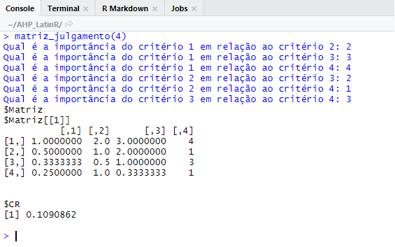
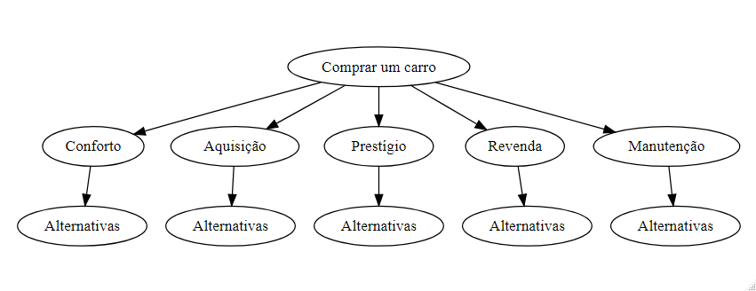
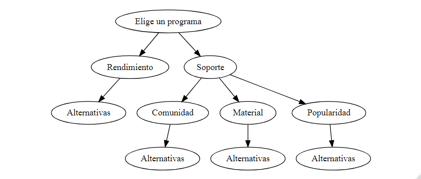
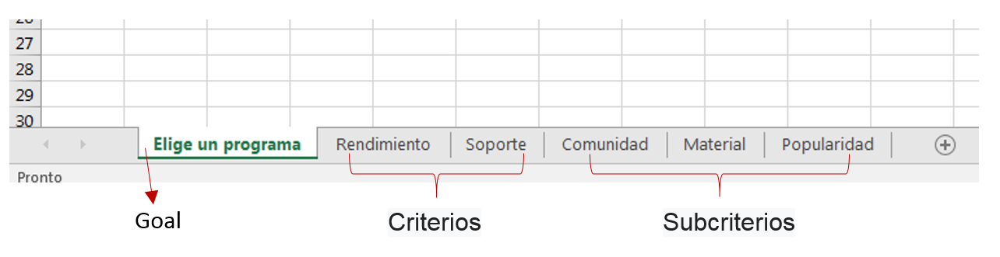

<style type="text/css">
body, td {
   font-size: 14px;
}
code.r{
  font-size: 20px;
}
pre {
  font-size: 20px
}
.remark-slide-content {
  font-size: 28px;
  padding: 20px 80px 20px 80px;
}
.remark-code, .remark-inline-code {
  background: #000000;
}
.remark-code {
  font-size: 16px;
}

</style>

```{r setup, include=FALSE}
options(htmltools.dir.version = FALSE)
```


Estudo sobre o método AHP e criação de um pacote.

Projeto PIBIC 2018/19 - Universidade Federal Fluminense

Grupo de Pesquisa: Estatística com R

Início: agosto de 2018

Plataforma Github

Linguagem: R


---
class: center, middle

# Tomar una decisión, establecer una meta

### Comprar un automóvil
### Elige un programa
### Elige un lugar de vacaciones

---
class: inverse, middle

#  ¿Cuales son las alternativas?

### Comprar un automóvil: Modelo A, B o C

### Elige un programa: R, Python, C++ o Java

### Elige un lugar de vacaciones: Rio de Janeiro, Santiago de Chile o Buenos Aires


---
class: center, middle

# Estoy 100% seguro de que estoy 0% seguro de lo que voy a hacer


---
class: inverse, center, middle

#  ¿Cuales son los criterios?

###comodidad, precio, prestigio, mantenimiento

---
class: inverse, center, middle

##  ¿Cuál es el método para tomar una decisión?

#Puedes elegir AHP
---


class: center, middle

# buena elección!


###El fin de tus dudas
---

# Método Utilizado para tomar una decisión

**AHP** (Analytic Hierarchy Process) fue creado por Saaty en 1970


se divide en tres pasos:

- construcción de niveles jerárquicos;

- Establecimiento de prioridades mediante juicios iguales de los criterios 
establecido ;

- evaluación de la coherencia lógica de los juicios de paridad.


---
#Prioridades

-Calcule los pesos de cada nivel y los pesos de las alternativas

-Ranquear as alternativas

---
#Matriz de Paridad o Matriz de Juicio


<style type="text/css">
.tg  {border-collapse:collapse;border-spacing:0;}
.tg td{font-family:Arial, sans-serif;font-size:14px;padding:10px 5px;border-style:solid;border-width:1px;overflow:hidden;word-break:normal;border-color:black;}
.tg th{font-family:Arial, sans-serif;font-size:14px;font-weight:normal;padding:10px 5px;border-style:solid;border-width:1px;overflow:hidden;word-break:normal;border-color:black;}
.tg .tg-bkfv{font-weight:bold;font-size:28px;background-color:#ffffff;border-color:#000000;text-align:center;vertical-align:top}
.tg .tg-zafg{font-size:28px;background-color:#ffffff;border-color:#000000;text-align:center;vertical-align:top}
.tg .tg-913x{font-weight:bold;font-size:28px;background-color:#ffffff;border-color:inherit;text-align:center;vertical-align:top}
.tg .tg-xpm5{font-size:28px;background-color:#c0c0c0;border-color:#000000;text-align:center;vertical-align:top}
</style>
<table class="tg">
  <tr>
    <th class="tg-bkfv">Criterios</th>
    <th class="tg-bkfv">  C1  </th>
    <th class="tg-bkfv">  C2  </th>
    <th class="tg-bkfv">  C3  </th>
  </tr>
  <tr>
    <td class="tg-913x">&nbsp;&nbsp;C1  &nbsp;&nbsp;</td>
    <td class="tg-xpm5">1</td>
    <td class="tg-zafg">4</td>
    <td class="tg-zafg">1/6</td>
  </tr>
  <tr>
    <td class="tg-913x">&nbsp;&nbsp;C2  &nbsp;&nbsp;</td>
    <td class="tg-zafg">1/4</td>
    <td class="tg-xpm5">1</td>
    <td class="tg-zafg">5</td>
  </tr>
  <tr>
    <td class="tg-913x">&nbsp;&nbsp;C3  &nbsp;&nbsp;</td>
    <td class="tg-zafg">6</td>
    <td class="tg-zafg">1/5</td>
    <td class="tg-xpm5">1</td>
  </tr>
</table>


###Recíproco de pares: si C1 es más importante que C2, entonces C2 es menos importante que C1

##juicios coherentes entre pares e entre todos

---
#Matriz de Paridad o Matriz de Juicio


<style type="text/css">
.tg  {border-collapse:collapse;border-spacing:0;}
.tg td{font-family:Arial, sans-serif;font-size:14px;padding:10px 5px;border-style:solid;border-width:1px;overflow:hidden;word-break:normal;border-color:black;}
.tg th{font-family:Arial, sans-serif;font-size:14px;font-weight:normal;padding:10px 5px;border-style:solid;border-width:1px;overflow:hidden;word-break:normal;border-color:black;}
.tg .tg-bkfv{font-weight:bold;font-size:28px;background-color:#ffffff;border-color:#000000;text-align:center;vertical-align:top}
.tg .tg-zafg{font-size:28px;background-color:#ffffff;border-color:#000000;text-align:center;vertical-align:top}
.tg .tg-913x{font-weight:bold;font-size:28px;background-color:#ffffff;border-color:inherit;text-align:center;vertical-align:top}
.tg .tg-xpm5{font-size:28px;background-color:#c0c0c0;border-color:#000000;text-align:center;vertical-align:top}
</style>
<table class="tg">
  <tr>
    <th class="tg-bkfv">Criterios</th>
    <th class="tg-bkfv">  C1  </th>
    <th class="tg-bkfv">  C2  </th>
    <th class="tg-bkfv">  C3  </th>
  </tr>
  <tr>
    <td class="tg-913x">&nbsp;&nbsp;C1  &nbsp;&nbsp;</td>
    <td class="tg-xpm5">1</td>
    <td class="tg-zafg">4</td>
    <td class="tg-zafg">1/6</td>
  </tr>
  <tr>
    <td class="tg-913x">&nbsp;&nbsp;C2  &nbsp;&nbsp;</td>
    <td class="tg-zafg">1/4</td>
    <td class="tg-xpm5">1</td>
    <td class="tg-zafg">5</td>
  </tr>
  <tr>
    <td class="tg-913x">&nbsp;&nbsp;C3  &nbsp;&nbsp;</td>
    <td class="tg-zafg">6</td>
    <td class="tg-zafg">1/5</td>
    <td class="tg-xpm5">1</td>
  </tr>
</table>


###C1 es mas importante que C2 que es mas importante que C3

así que C1 es mas importante que C3

C1 a juicio era menos importante que C3

inconsistencia!


---
#Probar la consistencia de los juicios

IC = <a href="https://www.codecogs.com/eqnedit.php?latex=\dpi{120}&space;\LARGE&space;\frac{\lambda_{max}&space;-n}{n-1}" target="_blank"></a>

<a href="https://www.codecogs.com/eqnedit.php?latex=\LARGE&space;\lambda&space;_{max}&space;=" target="_blank"></a> maior autovalor da matriz de paridad

n = número de criterios

IA = índice de consistencia aleatorio (tabulado)

##Grado de consistencia para cada matriz

CR = IC/IA < 0.1 ou 10%
---
#Instalación de paquete

```{r}
#install.packages("devtools")
#devtools::install_github("Lyncoln/AHP2")

library(AHP)
```


---
#Pruebe consistencia de matriz: CR()

```{r include=FALSE}
M = cbind(C1 = c(1, 1/4, 6),
          C2 = c(4, 1, 1/5),
          C3 = c(1/6, 5, 1))
knitr::kable(as.data.frame(round(M,2)))
```
<style type="text/css">
.tg  {border-collapse:collapse;border-spacing:0;}
.tg td{font-family:Arial, sans-serif;font-size:14px;padding:10px 5px;border-style:solid;border-width:1px;overflow:hidden;word-break:normal;border-color:black;}
.tg th{font-family:Arial, sans-serif;font-size:14px;font-weight:normal;padding:10px 5px;border-style:solid;border-width:1px;overflow:hidden;word-break:normal;border-color:black;}
.tg .tg-bkfv{font-weight:bold;font-size:28px;background-color:#ffffff;border-color:#000000;text-align:center;vertical-align:top}
.tg .tg-zafg{font-size:28px;background-color:#ffffff;border-color:#000000;text-align:center;vertical-align:top}
.tg .tg-913x{font-weight:bold;font-size:28px;background-color:#ffffff;border-color:inherit;text-align:center;vertical-align:top}
.tg .tg-xpm5{font-size:28px;background-color:#c0c0c0;border-color:#000000;text-align:center;vertical-align:top}
</style>
<table class="tg">
  <tr>
    <th class="tg-bkfv">Criterios</th>
    <th class="tg-bkfv">  C1  </th>
    <th class="tg-bkfv">  C2  </th>
    <th class="tg-bkfv">  C3  </th>
  </tr>
  <tr>
    <td class="tg-913x">&nbsp;&nbsp;C1  &nbsp;&nbsp;</td>
    <td class="tg-xpm5">1</td>
    <td class="tg-zafg">4</td>
    <td class="tg-zafg">1/6</td>
  </tr>
  <tr>
    <td class="tg-913x">&nbsp;&nbsp;C2  &nbsp;&nbsp;</td>
    <td class="tg-zafg">1/4</td>
    <td class="tg-xpm5">1</td>
    <td class="tg-zafg">5</td>
  </tr>
  <tr>
    <td class="tg-913x">&nbsp;&nbsp;C3  &nbsp;&nbsp;</td>
    <td class="tg-zafg">6</td>
    <td class="tg-zafg">1/5</td>
    <td class="tg-xpm5">1</td>
  </tr>
</table>

```{r}
library(AHP)

M = cbind(C1 = c(1, 1/4, 6),
          C2 = c(4, 1, 1/5),
          C3 = c(1/6, 5, 1))

CR(M) #Inconsistente para CR > 0.1
```

---
#Crea matrices emparejadas y pruebe su consistencia: matrizJulgamento()


**matriz_julgamento(qtd_comparacoes, CR = TRUE, qtd_matrizes = 1)**


---
#Bases de datos ejemplos : BD1, BD2, BD3, BD4 - tablas en xlsx
###Jerarquía BD1: comprar un auto, 5 criterios, 3 alternativas
6 tablas: 1 paridad entre criterios e 5 paridad entre alternativas para cada criterio

```{r}
library(AHP)
summary(BD1)
```

---
###Esquematicamente


---

###Alternativas
<style>
figure:hover{
    -webkit-transform:rotate(-5deg);
}
figure{
    background-color: white;
    width: 200px;
    text-align: center;
    padding: 15px;
    font-family: 'Comic Sans MS', cursive;
    border: 1px solid white;
    margin: auto;
}
#topo{
    text-align: center;
}
</style>
<section id="topo">
            <figure id="A">
                
                <figcaption>A</figcaption>
            </figure>
          <figure id="B">
                
                <figcaption>B</figcaption>
            </figure>
            <figure id="C">
                
                <figcaption>C</figcaption>
            </figure>
        </section>
        

---


#Jerarquía BD1: comprar un auto
Cinco criterios (un nivel)

```{r}
library(AHP)
BD1[1] #matriz de paridad nível criterios
```
---

#BD1 comprar un auto
###Cinco criterios:
CF (conforto), AQ (aquisição), PS (prestígio), RV (revenda), MA (manutenção)
###Tres Alternativas: A, B e C (modelos de autos)

```{r}
library(AHP)
BD1[2] #matriz de paridad critério 1: conforto
```

---

###Cinco criterios:
CF (conforto), AQ (aquisição), PS (prestígio), RV (revenda), MA (manutenção)
###Tres Alternativas: A, B e C (modelos de autos)

```{r}
library(AHP)
BD1[3] #matriz de paridad critério 2: aquisição
```

etcétera ...
---

#Cálculo del grado de consistencia: CR()

para cada una de las 6 matrices/tablas

```{r}
lapply(BD1, function(x) CR(x))

```


---

#Cálculo de peso matricial: calcula_prioridades()

```{r}
calcula_prioridades(BD1)[1]
```


---
#Pesos

```{r}
calcula_prioridades(BD1)
```
---
#Aplique ahp a una lista de matriz con formato adecuado: ahp_geral()

```{r}
tabela = ahp_geral(BD1) # No tiene subcriterios
tabela
```
**ahp_geral(base, mapeamento = "PADRÃO", nomes_alternativas = "PADRÃO")**


---
#Clasifique las alternativas de una tabla ahp: ranque()

```{r}
ranque(tabela)
```

<div class="box">
    
    <span> A </span>
</div>

<style>
div.box {
	width: 250px;
	display: inline-block;
}
</style>
---
#Formatea la tabla de resultados para la exportación: formata_tabela()

```{r}
formata_tabela(tabela)
```


---

```{r}
formata_tabela(tabela, cores = "BRANCO")
```

---

```{r}
formata_tabela(tabela, cores = "CINZA")
```


---

#Lectura de datos: ler()

```{r}
base<- 
  ler("tabelaLR.xlsx")
summary(base)
```
---

#Jerarquía


4 alternativas: R, Python, C++ o Java
---
#Organización de datos




mapeamento:
2 critérios no nivel 1: rendimento e soporte

Rendimento: 0 subcritérios

Soporte: 3 subcritérios

mapeamento = c(0,3)

---
#Mapeamento

Exemplo genérico

3 critérios no nível 1; 10 alternativas

Critério 1: 2 subcritérios; Critério 2: 2 subcritérios; 
Critério 3: 4 subcritérios

mapeamento = c(2, 2, 4)

12 tablas em arquivo xlsx em sequencia: M1(3x3), M2(2x2), M3(2x2), M4(4x4), M5 a M12(10x10)
---

###ahp_geral()
```{r}

tabela2 = ahp_geral(base, mapeamento = c(0,3)); tabela2
```

```{r}

tabela2 = ahp_geral(base, mapeamento = c(0,3),
                   c("R","Python","C++","Java")); tabela2
```


---
#Tabela formatada:
```{r}
formata_tabela(tabela2, cores = "CINZA")
```
---

#Ranque: 

```{r}
ranque(tabela2)
```

---
#Exemplo BD3

```{r}
library(AHP); library(magrittr)

ahp_geral(BD3, mapeamento = c(3,3,3)) %>% 
  formata_tabela(cores="BRANCO")
```

---

#Planes para el futuro:


- Mejorar el rendimiento computacional de las funciones;

- Desarrollar tutorial para las funciones;

- Desarrollar la función de imagen jerárquica;

- Interatividad con shiny.


---
class: inverse, center, middle

Gracias!!!

e-mail: lucianea@id.uff.br

twitter: @alcoforadouff

---
